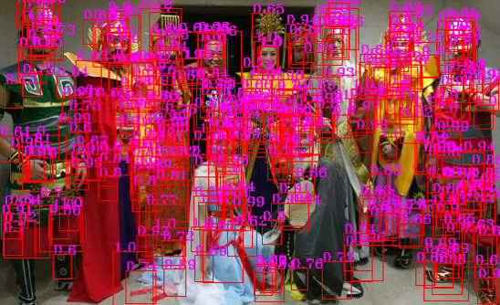
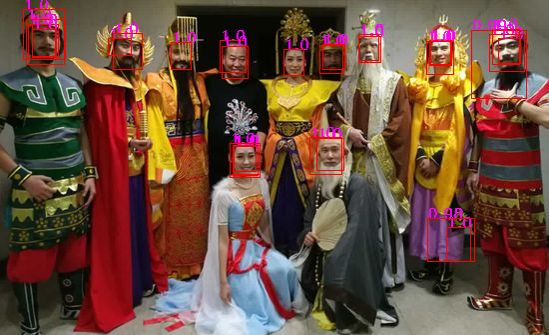
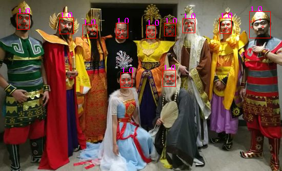
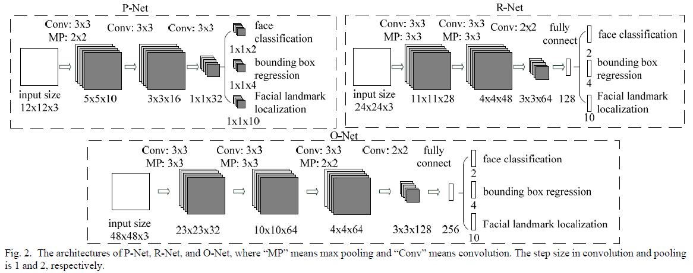
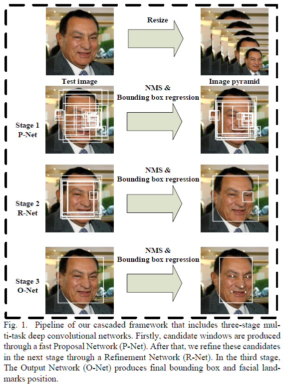

# MTCNN tensorflow.keras实现

## 1 数据集

* 下载[WIDERFace](http://mmlab.ie.cuhk.edu.hk/projects/WIDERFace/)，将里面的WIDER_train文件夹放置到data下。

* 下载[Deep Convolutional Network Cascade for Facial Point Detection](http://mmlab.ie.cuhk.edu.hk/archive/CNN_FacePoint.htm)，将里面的lfw_5590和net_7876文件夹放置到data下。


## 2 结果

下面3张图分别为PNet、RNet、ONet的输出，最后ONet输出的landmark坐标有点不太准，可以增加训练步数，修改学习速率等。这里我仅作为演示没有仔细调参。








## 3 训练

**本项目在PNet和RNet阶段，未使用landmark数据。**

> python gen_widerface.py 生成pnet数据；
>
> python train_pnet.py 开始训练pnet。


> 修改gen_hard_example.py中的参数mode=1,
>
> python gen_hard_example.py 生成rnet数据；
>
> python train_rnet.py 开始训练rnet。


> 修改gen_hard_example.py中的参数mode=2,
>
> python gen_hard_example.py 生成onet数据；
>
> python gen_landmark.py生成landmark数据；
>
> python train_onet.py 开始训练onet。


## 4 测试

> ```shell
> python test.py
> ```
>
> **修改test.py文件中的：**
>
> img_path 图片所在路径
>
> weight_dir 模型所在路径
>
> mode 检测模式; 1表示用PNet，2表示用PNet-RNet，3表示用PNet-RNet-ONet
>
> Detector里的参数分别代表检测的最小脸大小、每个阶段的分数阈值、multi-scale每次乘的因子。


## 5 策略

### 5.1 数据生成

> **各部分人脸数据占比。**
>
> Positive(iou>0.6) : Part(iou>0.4) : Negative(iou<0.3) : Landmark = 1 : 1 : 3 : 1

### 5.2 损失函数

> **各部分损失函数权重。**
>
> 人脸二分类 (CrossEntropy) = 1
>
> 人脸框 (MSE) = 0.5
>
> 关键点 (MSE) = 0.5

### 5.3 OHEM

> 在线困难样本挖掘，仅在训练face/non-face classification时使用，
> 具体做法是：对每个mini-batch的数据先通过前向传播，在反向传播时仅使用损失最大前70%的样本产生的损失。

### 5.4 网络结构图




